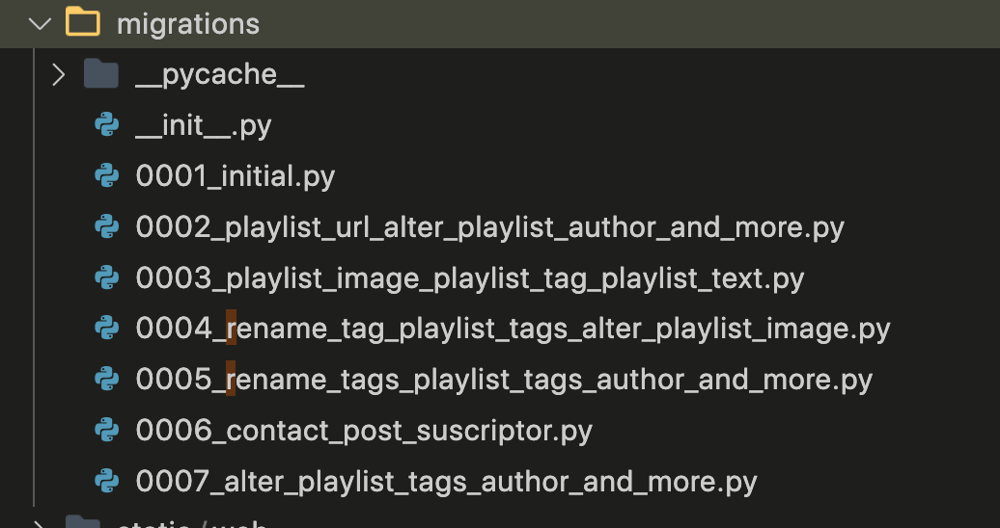
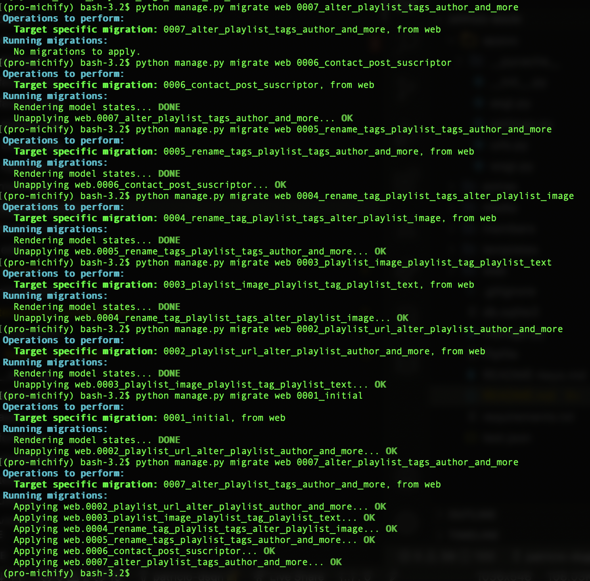

 

# michify

Este proyecto es para recopilar _playlist_ creados por artistas.

## Módulo 6 - ABP 3

- Página que muestra información de los usuarios registrados.

- Regístro de usuarios en admin (5 usuario - 3 atributos)

- Estilos de CSS

- Imágenes

- Front-end framework [MaterilizeCSS](https://materializecss.com/) ( uso de clases de la libreria y parallax en pagina nosotros)

- Footer y navbar mediante _block content_

## Módulo 6 - ABP 4

- Formulario que guarda información de los usuarios (Regístro) 

- Estilos de CSS

- Logo

## Módulo 6 - ABP 5

- Funcionalidad de login/logout en su página web.

- Template para login

- Inicio personalizado, nombre del usuario, mensaje de bienvenida

- Restricción de acceso. http://127.0.0.1:8000/mymessages (se requiere loguearse)

## Módulo 6 - ABP 6

- 2 grupos de usuarios (con permisos diferenciados)

    - **Editores Listas** tienen permisos para editar listas

    - **Bloguers** tienen permisos para crear posts

- Formulario para crear usuarios (Formulario de regístro)

## Módulo 7 - ABP 1

- Nuevo modelo desde Django para nuevos usuarios

- Migrar los modelos a tablas
  
- Template con tabla de los usuarios registrados
(en lugar de usuario se ha creato las lista de musica en diferentes formatos (JSON, fake JSON, html) - link en el footer)

- Front-end framework [MaterilizeCSS](https://materializecss.com/)

## Módulo 7 - ABP 2

- Conección a MySQL

- Comentarios (Template para Escribir, visualizar y borrar usando usuario o correo)

## Módulo 7 - ABP 3

- Modelo de acceso a datos (el uso de entidades con relaciones)
para dar solución a los diferentes requerimientos funcionales de su proyecto.

    - Uno a uno

    - Uno a muchos

    - Muchos a muchos

- Regístro y gestión de la información relacionada a los diferentes procesos.

- Templates visualizar relaciones del modelo de datos

## Módulo 7 - ABP 5

- vuelta a migraciones anteriores (a la primera y hasta la actual)
 
 

- IrreversibleError:

    **IrreversibleError**: Es un error al intentar revertir a una migracion que continen operaciones irreversibles. Cuando se elimina un campo de un modelo y se invierte, esto es en realidad agregar un campo a un modelo. La operación es reversible (aparte de cualquier pérdida de datos,que es irreversible)si el campo es anulable o si tiene un valor por defecto que puede utilizarse para poblar la columna recreada. Si el campo no es anulable y no tiene un valor por defecto,la operación es irreversible.

## Módulo 7 - ABP Sprint 7

- Front end: Componentes de Front end en función usabiblidad

- Bases de datos: PostgreSQL

- Back-end: Manipular, mostrar, recoger o procesar datos.

- Django: gestiona bases de datos, creación de usuarios, permisos, formularios.

---

 

## Instrucciones para levantar el proyecto

- En el archivo **requirements.txt** estan las librerias necesarias para levantar el proyecto

- El entorno virtual usado es **Pipenv**

- Las contraseñas de prueba para cada usuario estan **README-keys.txt**.

<!-- <kbd style="width:80%;"> 
    
</kbd> -->